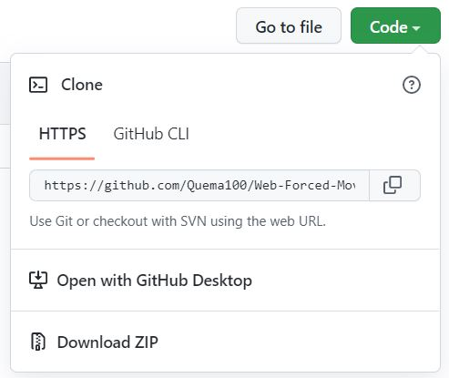
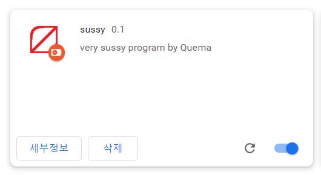

# 웹 강제 이동 크롬 확장프로그램
이 프로그램은 웹 강제이동을 하기위해 만들어졌습니다.

```javascript
if(window.location.href.startsWith('URL'))return;
var link =window.location.replace('URL');
```

URL부분에 원하시는 링크를 추가하세요.


# **사용 방법**
1.소스를 복사하거나 다운받는다.



2.다운받은 파일을 <chrome://extensions/> 에서 개발자 모드를 활성화 후 파일을 업로드한다

  - ``` 압축해제된 확장프로그램을 업로드합니다 ``` 버튼을 누른다

3.확장프로그램 활성화 후
 
- ***id부분은 지웠습니다***

4.사용했을 때 예시 영상

- [예시 영상](https://www.youtube-nocookie.com/embed/jWVJ2bMylc4?controls=0)

**주의사항**

- 삽입한 링크 앞에 부분이 같은 사이트에서 이용할시 작동이 불가합니다
  - EX) https://www.youtube.com , https://www.youtube.com/c/youtubekorea 이런식으로 앞부분이 같으면 작동이 불가합니다


## 기타
- 도와주신분
  - @KoreaHanwoo님
